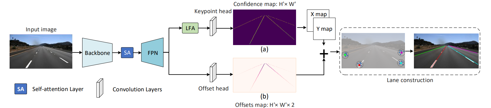

# GANet
This repo is the PyTorch implementation for our paper:

[A Keypoint-based Global Association Network for Lane Detection](https://arxiv.org/abs/2204.07335). Accepted by CVPR 2022.


In this paper, we propose a Global Association Network (GANet) to formulate the lane detection problem from a new perspective, where each keypoint is directly regressed to the starting point of the lane line instead of point-by-point extension. Concretely, the association of keypoints to their belonged lane line is conducted by predicting their offsets to the corresponding starting points of lanes globally without dependence on each other, which could be done in parallel to greatly improve efficiency. In addition, we further propose a Lane-aware Feature Aggregator (LFA), which adaptively captures the local correlations between adjacent keypoints to supplement local information to the global association.
## Update
* [2022/10/27]: We have released a new version of GANet, updated the version of dependent packages, and simplified the code. Switch to the mmdet2_25 branch for details.

## Installation
 1. Create a conda virtual environment and activate it.
    ```shell
    conda create -n ganet python=3.7 -y
    conda activate ganet
    conda install pytorch==1.6.0 torchvision==0.7.0 cudatoolkit=10.1 -c pytorch -y
    pip install -r requirements/build.txt
    ```
 2. Clone this repository and enter it:
    ```Shell
    git clone https://github.com/Wolfwjs/GANet.git
    cd GANet
    python setup.py develop
    ```

## Dataset
Download datasets and put it into `[data-path]` folder. And edit the `data_root` in the config file to your dataset path.
### CULane
[\[CULane website\]](https://xingangpan.github.io/projects/CULane.html)
[\[Download\]](https://drive.google.com/drive/folders/1mSLgwVTiaUMAb4AVOWwlCD5JcWdrwpvu)


The directory structure should be like follows:
```
[data-path]/culane
├── driver_23_30frame
├── driver_37_30frame
├── driver_100_30frame
├── driver_161_90frame
├── driver_182_30frame
├── driver_193_90frame
└── list
    └── test_split
    |   ├── test0_normal.txt
    |   ├── test1_crowd.txt
    |   ├── test2_hlight.txt
    |   ├── test3_shadow.txt
    |   ├── test4_noline.txt
    |   ├── test5_arrow.txt
    |   ├── test6_curve.txt
    |   ├── test7_cross.txt
    |   └── test8_night.txt
    └── train.txt
    └── test.txt
    └── val.txt

```
### TuSimple
[\[TuSimple website\]](https://github.com/TuSimple/tusimple-benchmark/tree/master/doc/lane_detection)
[\[Download\]](https://github.com/TuSimple/tusimple-benchmark/issues/3)

The directory structure should be like follows:
```
[data-path]/tusimple
├── clips
├── label_data_0313.json
├── label_data_0531.json
├── label_data_0601.json
├── label_data_0601.json
├── test_label.json
└── test_baseline.json

```
## Evaluation
Here are our GANet models (released on April 24th, 2022):

### CULane
| Version |   Backbone    | FPS |  F1   | Weights                                                                                                          | 
|:-------:|:-------------:|:---:|:-----:|------------------------------------------------------------------------------------------------------------------|
|  Small  |   ResNet18    | 153 | 78.79 | [ganet_culane_resnet18.pth](https://drive.google.com/file/d/1-L7cfKYeiQVxaDlN9dxnNH9cWp5wIt7f/view?usp=sharing)  | 
| Medium  |   ResNet-34   | 127 | 79.39 | [ganet_culane_resnet34.pth](https://drive.google.com/file/d/1fJQPecJn1FVXAux2YTIEPQHhlNv7sHC9/view?usp=sharing)  | 
|  Large  |  ResNet-101   | 63  | 79.63 | [ganet_culane_resnet101.pth](https://drive.google.com/file/d/1X49SLAbzrFTjiRzp_YUiP7eOmFCToIJM/view?usp=sharing) | 

### TuSimple
| Version |   Backbone    | FPS |  F1   | Weights                                                                                                            | 
|:-------:|:-------------:|:---:|:-----:|--------------------------------------------------------------------------------------------------------------------|
|  Small  |   ResNet18    | 153 | 97.71 | [ganet_tusimple_resnet18.pth](https://drive.google.com/file/d/1Zbo0CdjksWK46gpuuB6NMvPxc0Zu50fD/view?usp=sharing)  | 
| Medium  |   ResNet-34   | 127 | 97.68 | [ganet_tusimple_resnet34.pth](https://drive.google.com/file/d/1NpnWQQJPrmKHe9LAQkej3RKi9qq1allC/view?usp=sharing)  | 
|  Large  |  ResNet-101   | 33  | 97.45 | [ganet_tusimple_resnet101.pth](https://drive.google.com/file/d/1b5kPp79MabCRH06CEGXvj_XW11SR8ROM/view?usp=sharing) | 

To evalute the model, download the corresponding weights file into the `[CHECKPOINT]` directory and run the following commands.

```shell
# For example, model = ganet-small 
sh slurm_test.sh [PARTITION] [JOB_NAME] tusimple final_exp_res18_s8 [CHECKPOINT]
sh dist_test.sh tusimple final_exp_res18_s8 [CHECKPOINT]
```
We use the official evaluation tools of [CULane](https://github.com/XingangPan/SCNN) and [TuSimple](https://github.com/TuSimple/tusimple-benchmark/tree/master/evaluate) to evaluate the results. And we include them in `tools` directory which may be helpful for you.
## Training
```shell
# For example, model = ganet-small 
sh slurm_train.sh [PARTITION] [JOB_NAME] tusimple final_exp_res18_s8 ./output
sh dist_train.sh tusimple final_exp_res18_s8 ./output
```
# Citation
If you find this repo useful for your research, please cite
```
@inproceedings{ganet-cvpr2022,
  author    = {Jinsheng Wang, Yinchao Ma, Shaofei Huang, Tianrui Hui, Fei Wang, Chen Qian, Tianzhu Zhang},
  title     = {A Keypoint-based Global Association Network for Lane Detection},
  booktitle = {CVPR},
  year      = {2022},
}
```

# Contact

For questions about our paper or code, please contact [Jinsheng Wang](mailto:jswang@stu.pku.edu.cn) or [Yinchao Ma](mailto:imyc@mail.ustc.edu.cn)
